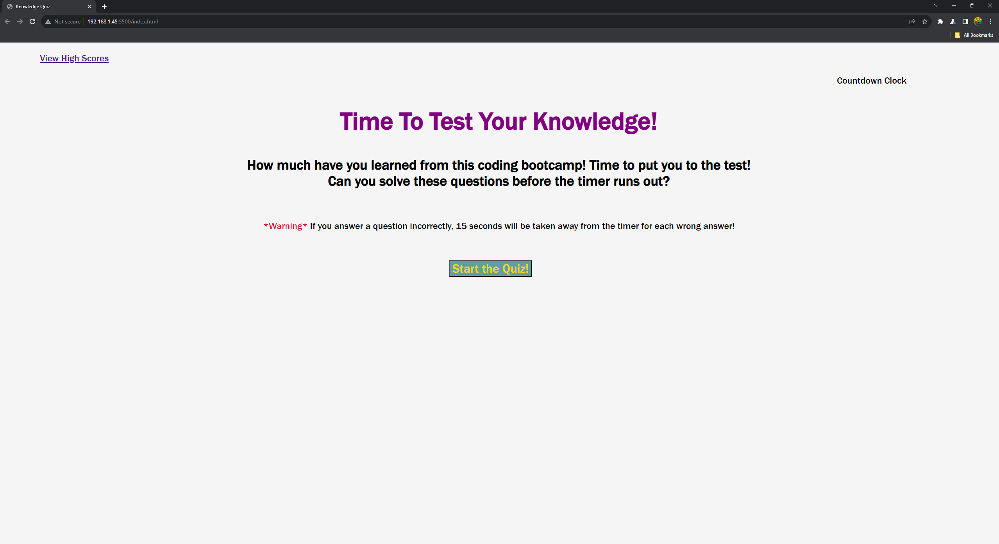
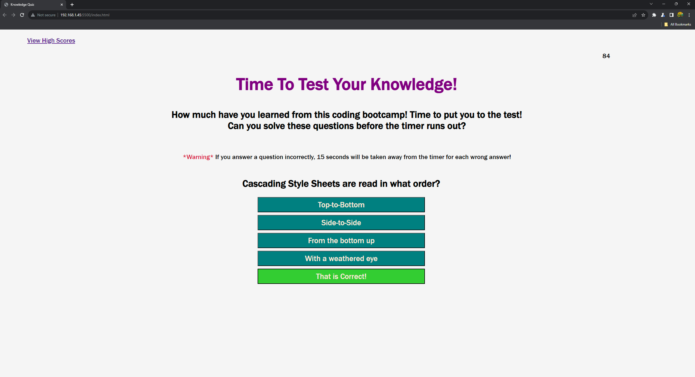
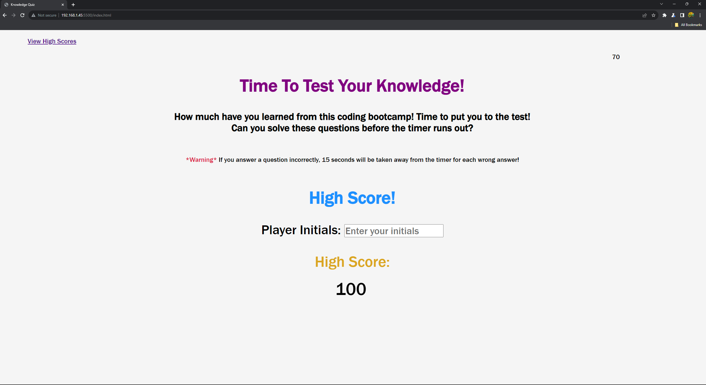
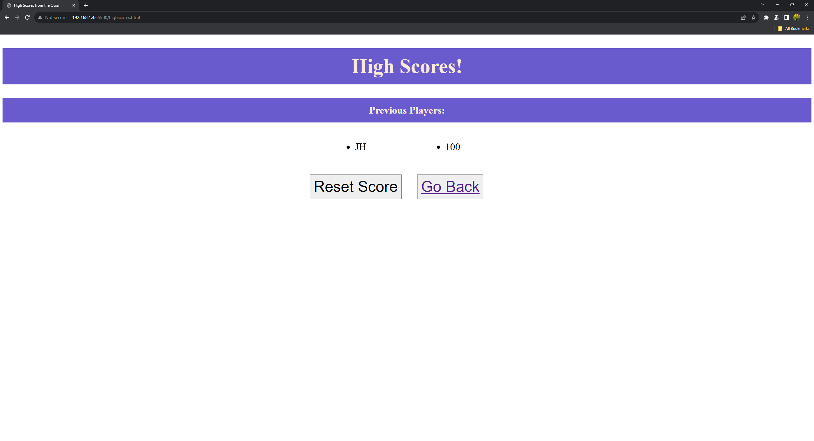

# Knowledge-Quiz

## Description

This project was a test of all the skills we have learned so far. It pushed me to my limits when it came to structuring HTML to support the corresponding Javascript. I learned a tremendous amount about how to use and incorporate objects and how to iterate through arrays and arrays within arrays for the logic for my quiz questions. I learned how to link different Javascript pages to their respective HTML pages. I also learned how to incorporate local storage elements into my code buidling, allowing for the cache of user information to be recalled later by the user, allowing for a smoother interface with the user experience.

This project also reinforced the learned skills of the event listener event and the logic which can be placed and used within it. The order of operations when it comes to reading Javascript became critical to get all the components to run correctly and execute the code the way it was meant to be executed.

The countdown clock presented another challenge which allowed me to reinforce my learned skills. The required variables and thought-process to make the code run correctly and stop when it was meant to was a motivating challenge.

The purpose of this quiz was two-fold, one was to reinforce the learned coding skills we were taught in class, and the second has a knock-on effect of allowing a person to review some of the knowledge they learned while in class and test themselves on specific trivia.

## Usage

In order to use this Knowledge Quiz, you must first download the code from github pages.
[Github Pages(www.github.com)]

Click on the green code button and then copy with HTTPS or SSH key

Clone the repository onto your computer using Git Bash or its equivalent.

Using Git Bash or its equivalent find the repository and open with `code .` .

From there, select the index.html and open with the Live Server extension or its equivalent.

You should be greeted with the following image:

Click on the start button to begin the timer and start on the first question. Correct questions will display green at the bottom letting you know you answered correctly. Wrong answers with display red and let you know that you chose the wrong answer.

At the end of the quiz, you will have the ability to enter your initials to put on the scoreboard.

You can check your score ranking compared to others on the corresponding High Scores page linked on the top left of the page which will lead you to this page:

A deployed version of this website can be found at: https://jhuber1155.github.io/Knowledge-Quiz

## Credits

I would like to credit my Instructor and Teaching Assistant for all the invaluable help they continue to provide me, as well as the students in my UCLA Coding Bootcamp class! I was able, with their guidance and help, in conjunction with the study materials, to put this together after many many hours of work.

Also I used many references and examples from:

w3schools [w3schools](https://www.w3schools.com/)

MDN Web Docs [MDN Web Docs](https://developer.mozilla.org/en-US/)

These examples and references include but are not limited to:
how to correctly use .setAttribute and .removeAttribute, the hidden and visible classes, how to display an array within an array, how to read data from an object using an array, and many many more.

## License
Copyright (c) [2023] [John Huber]

Permission is hereby granted, free of charge, to any person obtaining a copy of this software and associated documentation files (the "Software"), to deal in the Software without restriction, including without limitation the rights to use, copy, modify, merge, publish, distribute, sublicense, and/or sell copies of the Software, and to permit persons to whom the Software is furnished to do so, subject to the following conditions:

The above copyright notice and this permission notice shall be included in all copies or substantial portions of the Software.

THE SOFTWARE IS PROVIDED "AS IS", WITHOUT WARRANTY OF ANY KIND, EXPRESS OR IMPLIED, INCLUDING BUT NOT LIMITED TO THE WARRANTIES OF MERCHANTABILITY, FITNESS FOR A PARTICULAR PURPOSE AND NONINFRINGEMENT. IN NO EVENT SHALL THE AUTHORS OR COPYRIGHT HOLDERS BE LIABLE FOR ANY CLAIM, DAMAGES OR OTHER LIABILITY, WHETHER IN AN ACTION OF CONTRACT, TORT OR OTHERWISE, ARISING FROM, OUT OF OR IN CONNECTION WITH THE SOFTWARE OR THE USE OR OTHER DEALINGS IN THE SOFTWARE.